# Build Autonomous Pipelines for AI Agents

End-to-end quickstart for building a real-time Transportation Management System (TMS) data platform using Snowflake DCM Projects, Openflow, Dynamic Tables, and Cortex AI.

Stream real-time data from a Kafka endpoint using the Openflow Kafka connector. In Snowflake, build a three-layer architecture: **RAW** (ingested Kafka topics), **TRANSFORM** (two-layer Dynamic Table pipeline — cleansing + analytics), and **ANALYTICS** (views ready for Cortex Agent consumption).

## Folder guide

| Folder | Description |
|---|---|
| [`1_bootstrap/`](1_bootstrap/README.md) | Account setup — `SUMMIT_ADMIN` role, grants, DCM project object, Openflow deployment, network access |
| [`2_dcm_project/`](2_dcm_project/README.md) | DCM project — database, schemas, 9 raw tables, 9 clean DTs, 5 analytic DTs, 5 analytics views, roles |
| [`3_generate/`](3_generate/README.md) | Synthetic data generator — Kafka/Redpanda producer and consumer |
| [`4_openflow/`](4_openflow/README.md) | Openflow connector configuration for Kafka ingestion |
| [`5_fraud_detection/`](5_fraud_detection/README.md) | AI-powered fraud detection — heuristic scorer + Cortex AI enrichment (AI_CLASSIFY, AI_COMPLETE) |
| [`6_cortex-agent/`](6_cortex-agent/) | Semantic view creation and Cortex Agent (SQL + Cortex Code prompts) |
| [`7_streamlit/`](7_streamlit/) | Streamlit in Snowflake operations dashboard (Cortex Code prompt) |
| [`helpers/`](helpers/README.md) | Reference and helper scripts |
| `assets/` | Screenshots and diagrams for the quickstart |

## Prerequisites

**Snowflake Setup:**
- Enterprise Snowflake account with Openflow deployment and runtimes enabled
- ACCOUNTADMIN access needed for bootstrap (roles, Openflow deployment, external access integration, network rules)

**Kafka Setup:**
- We provide a Kafka endpoint for this quickstart — no setup needed
- You can also use your own Kafka cluster (Confluent, Amazon MSK, Redpanda, etc.)

**Local workspace:**
- Python 3.13+
- [Snowflake CLI](https://docs.snowflake.com/en/developer-guide/snowflake-cli/index) (`snow`) v3.16.0+ installed
- [Redpanda CLI](https://docs.redpanda.com/current/get-started/rpk-install/) (`rpk`) for topic management

## Quickstart

### 1. Configure environment

#### Python environment

```bash
# Verify Python 3.13+ is available
python3 --version  # Must show 3.13 or higher

# If below 3.13, install it first:
#   macOS:  brew install python@3.13
#   Ubuntu: sudo apt install python3.13 python3.13-venv
# Then use the explicit path: /opt/homebrew/bin/python3.13 -m venv .venv

python3 -m venv .venv
source .venv/bin/activate
pip install --upgrade pip
pip install kafka-python-ng python-dotenv snowflake-cli snowflake-connector-python ipykernel
pip install "snowflake-connector-python[pandas]"
```

#### Create a Programmatic Access Token (PAT)

Generate a PAT restricted to the `SUMMIT_ADMIN` role. Run this in Snowsight or any authenticated session:

```sql
ALTER USER ADD PAT summit_admin_pat
  ROLE_RESTRICTION = 'SUMMIT_ADMIN'
  DAYS_TO_EXPIRY = 7
  COMMENT = 'PAT for summit quickstart';
```

Copy the `token_secret` from the output — it is only shown once. You will use it as `SNOWFLAKE_PAT` in the next step.

> **Note:** The `SUMMIT_ADMIN` role must already be granted to your user (Step 2 does this). If you haven't bootstrapped yet, go to bootstrap section and configure the foundational roles and access for your account.

#### Environment file

All scripts read parameters from environment variables (`.env`). Copy the template and fill in your values:

```bash
cp .env.template .env
# edit .env with your Snowflake and Kafka credentials
```

| Env var | Default | Description |
|---|---|---|
| **Snowflake connection** | | |
| `SNOWFLAKE_ACCOUNT` | `MYORG-MYACCOUNT` | Snowflake account identifier (org-account format) |
| `SNOWFLAKE_USER` | `myuser` | Snowflake username |
| `SNOWFLAKE_ROLE` | `SUMMIT_ADMIN` | Role used for DCM operations |
| `SNOWFLAKE_WAREHOUSE` | `SUMMIT_WH` | Warehouse for CLI operations |
| `SNOWFLAKE_CONNECTION_NAME` | `summit` | Named connection for snow CLI |
| `SNOWFLAKE_PAT` | — | Programmatic Access Token for authentication |
| **DCM Project** | | |
| `DCM_DATABASE` | `DCM_DB` | Database containing the DCM project object |
| `DCM_SCHEMA` | `PROJECTS` | Schema containing the DCM project object |
| `DCM_PROJECT` | `DCM_PROJECT_DEV` | Name of the DCM project |
| **Kafka** | | |
| `KAFKA_BOOTSTRAP_SERVERS` | `localhost:9092` | Broker address |
| `KAFKA_USERNAME` | `kafka_user` | SASL username |
| `KAFKA_PASSWORD` | `kafka_pass` | SASL password |
| `KAFKA_TOPIC_PREFIX` | `tms` | Prefix for all topic names |
| **TMS Producer** | | |
| `TMS_ORDER_COUNT` | `1` | Number of orders to generate |
| `TMS_DELAY` | `1.0` | Seconds between orders |
| `TMS_FRAUD_RATE` | `0.01` | Fraction of fraudulent orders |
| `TMS_RETURN_RATE` | `0.02` | Fraction of returned packages |
| `TMS_DAYS_BACK` | `7` | Spread orders over past N days |

#### Configure Snowflake CLI

```bash
source .env
bash helpers/setup_snow_cli_connection.sh
```

#### Configure Redpanda CLI

```bash
source .env
bash helpers/setup_rpk_profile.sh
```

#### Verify Kafka connectivity

```bash
source .env
python3 helpers/test_kafka_connection.py
```

### 2. Bootstrap the account

Run `1_bootstrap/setup.sql` as **ACCOUNTADMIN** in Snowsight or via the CLI:

```bash
snow sql -f 1_bootstrap/setup.sql -c <connection_name>
```

This creates the `SUMMIT_ADMIN` role, `DCM_DB` database, `SUMMIT_WH` warehouse, the Openflow deployment (`SUMMIT_DEPLOYMENT`), and network access rules for the Kafka broker.

See [`1_bootstrap/README.md`](1_bootstrap/README.md) for full details.

### 3. Deploy the DCM project

Update `2_dcm_project/manifest.yml` with your account identifier, then:

```bash
snow dcm plan  --target DCM_DEV --from 2_dcm_project
snow dcm deploy --target DCM_DEV --from 2_dcm_project
```

This creates the entire data platform: database, 4 schemas, 9 raw tables, 14 dynamic tables (9 clean + 5 analytic), 5 analytics views, warehouse, and roles with grants.

### 4. Post-deploy and seed data

```bash
# Create the Openflow runtime in the deployed database
snow sql -f 2_dcm_project/scripts/post_deploy.sql \
  --variable "env_suffix=_DEV" --enable-templating JINJA

# Load reference data and 1 sample end-to-end order
snow sql -f 2_dcm_project/scripts/seed_data.sql \
  --variable "env_suffix=_DEV" --enable-templating JINJA
```

### 5. Generate and stream data

We provide a Kafka endpoint with real-time data already streaming. If you want to test with your own Kafka Cluster run:

```bash
# Dry-run (print to stdout, no Kafka)
python3 3_generate/tms_producer.py --dry-run --count 1

# Push orders to Kafka
python3 3_generate/tms_producer.py --count 5

# Consume and display messages
python3 3_generate/tms_consumer.py --from-beginning
```

See [`3_generate/README.md`](3_generate/README.md) for full producer/consumer documentation.

### 6. Configure Openflow connector

Import the Kafka connector into your Openflow runtime to stream data from Kafka into Snowflake:

1. Using the `DCM_ADMIN` Role, Open the Openflow runtime in Snowsight
2. In the canvas drag-and-drop **Import from Registry** → and choose the flow **kafka-json-sasl-topic2table-schemaev**

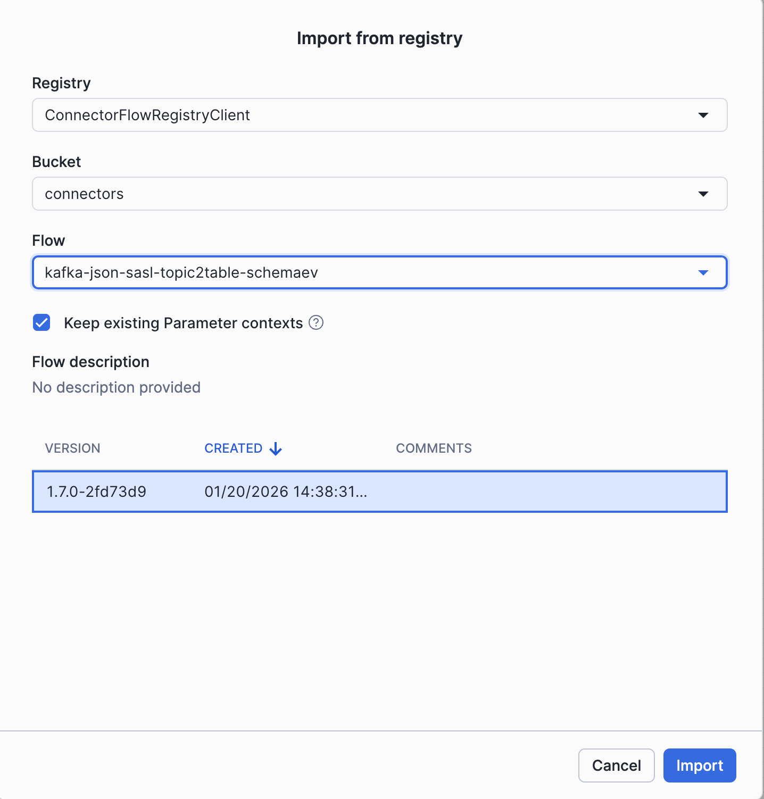

3. Right Click on the Process Group and to update the parameters:

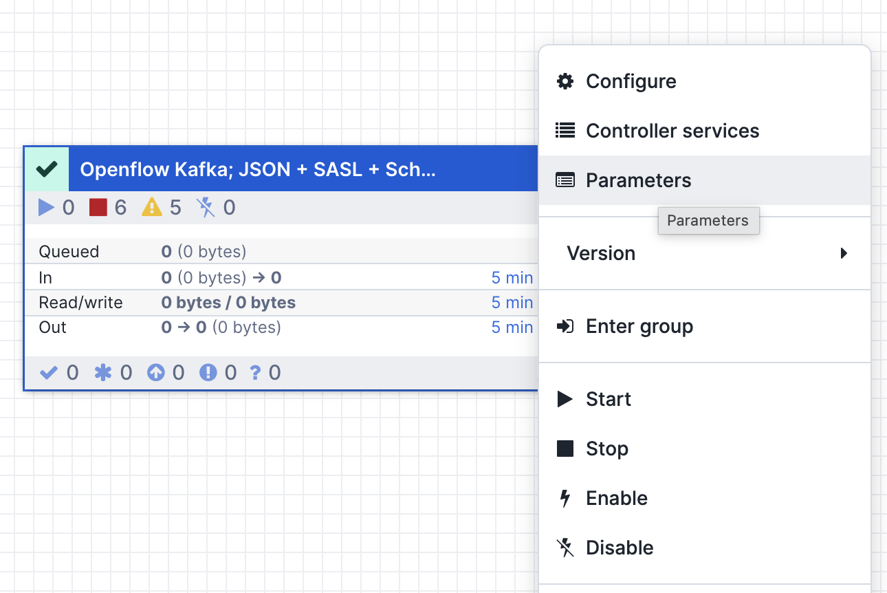

   - **The Source parameters**: add your Kafka broker, SASL username/password, use SASL_SSL as security protocol

   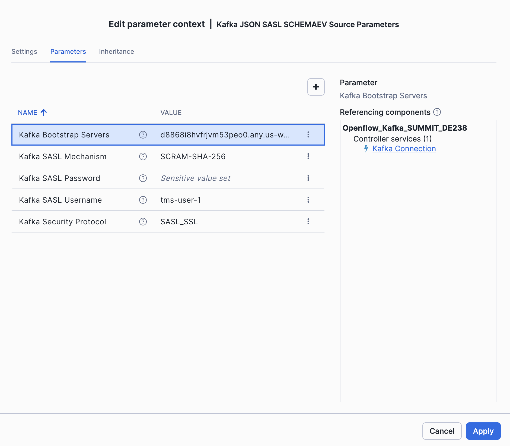

   - **The Destination parameters**: db `SUMMIT_DB_DEV`, schema `RAW`, role `INGEST_ROLE_DEV`, use SNOWFLAKE_MANAGED authentication

   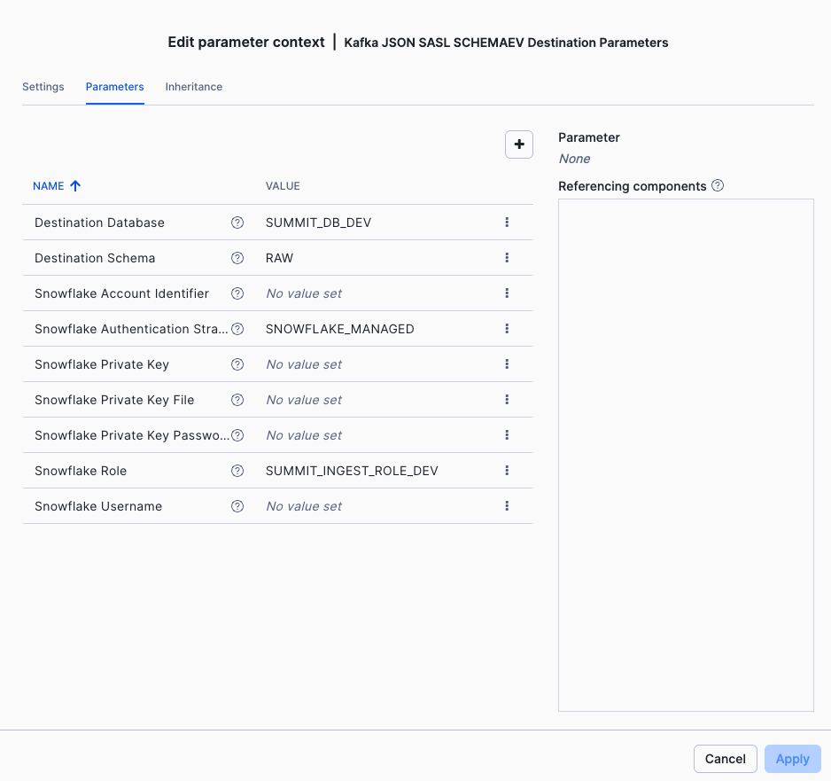

   - **Ingestion parameters**: update topic format to `pattern`, use pattern `tms-.*`, consumer group is your `username` with -group suffix (e.g. tms-user-1-group)

   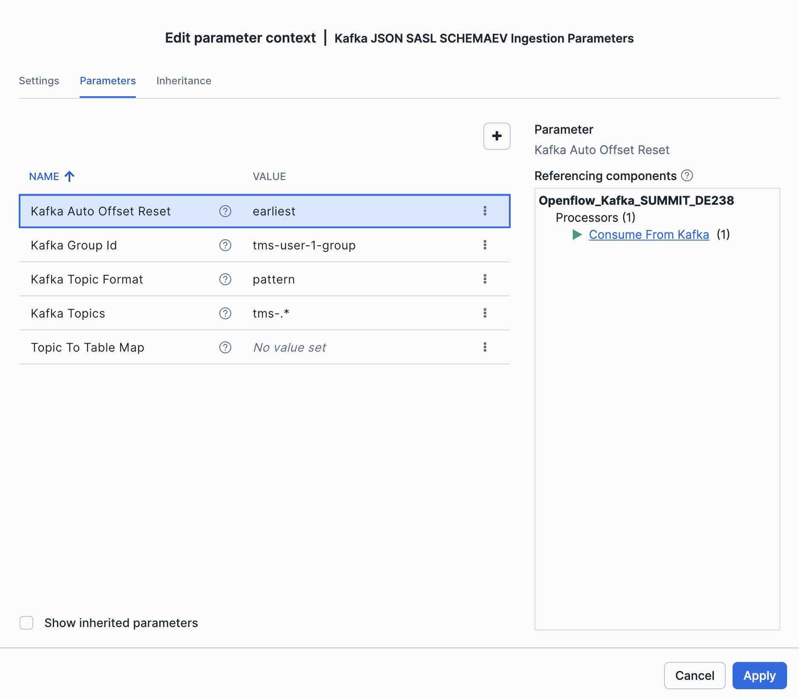

4. Update the Topic to Table mapping processor, by double chicking on the main processor group, and navigate to `Map Topic to Table` processor, the regex will remove the topic prefix and transform topic names to snowflake table names.

```
${kafka.topic:substringAfter('tms-'):replace('-', '_'):toUpper()}
```

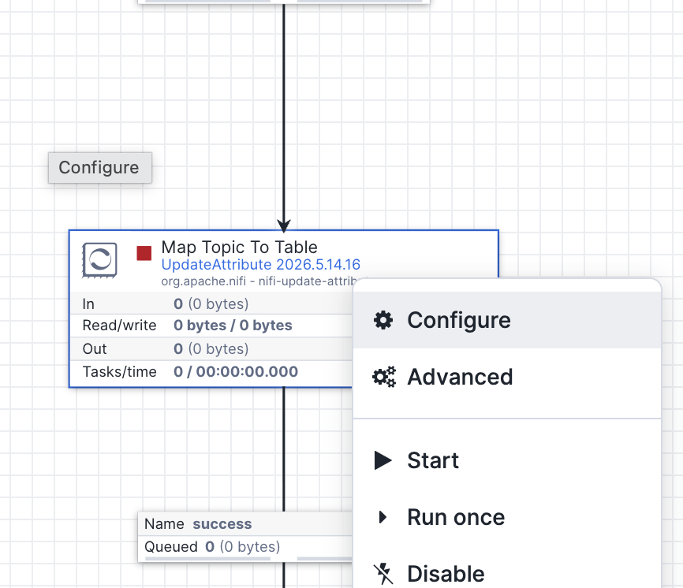

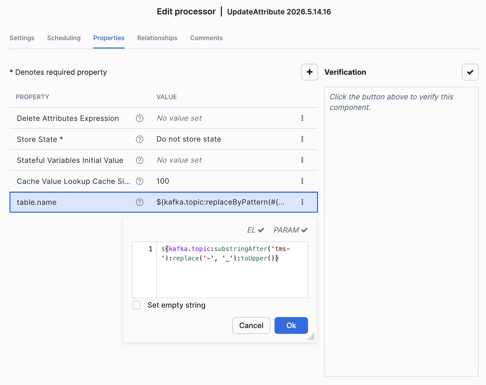


5. Start the connector by enabling the controller services

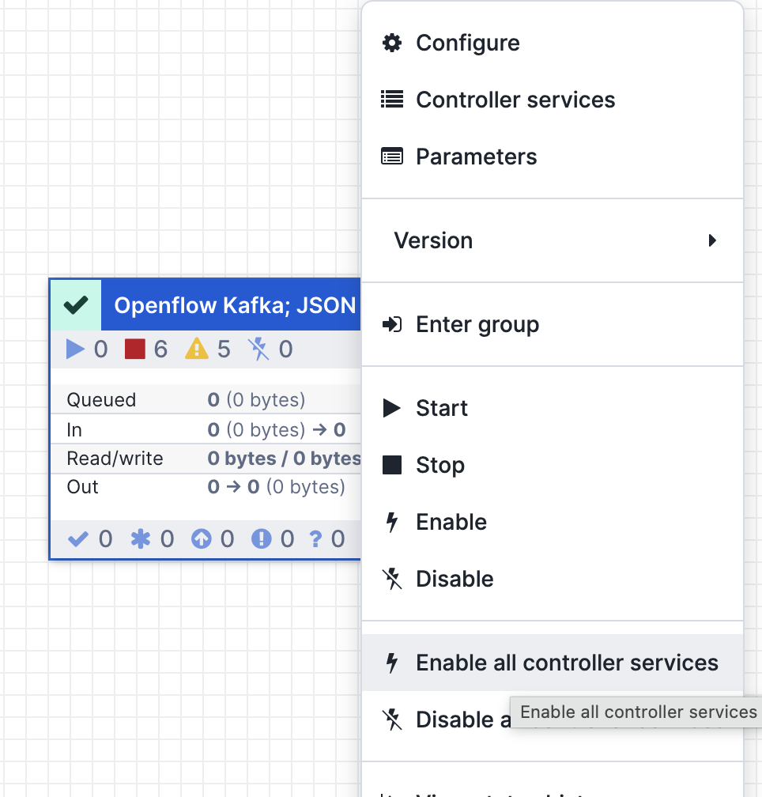

and right click on the main processor group, click Start

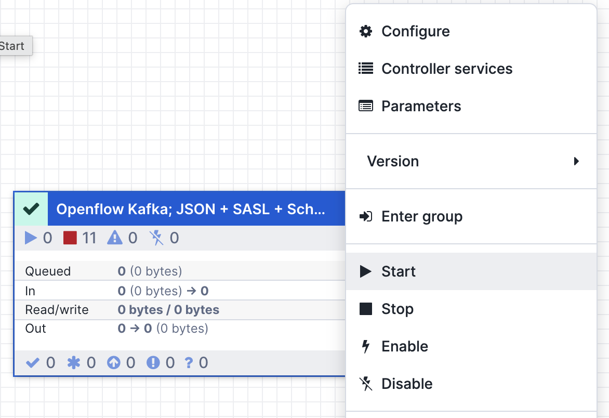


6. You should see data flowing in:

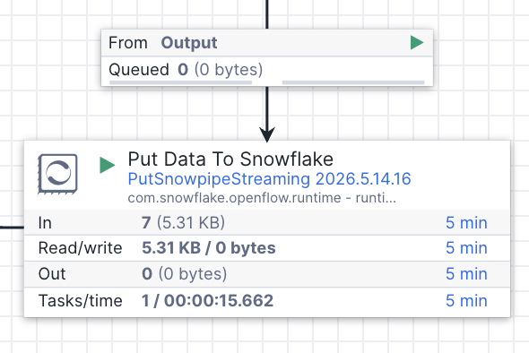


(Optionally) In the [`4_openflow/Openflow_Kafka_SUMMIT_DE238.json`](4_openflow/Openflow_Kafka_SUMMIT_DE238.json) you can find an example flow, that can be imported in case you get into configuration problems.

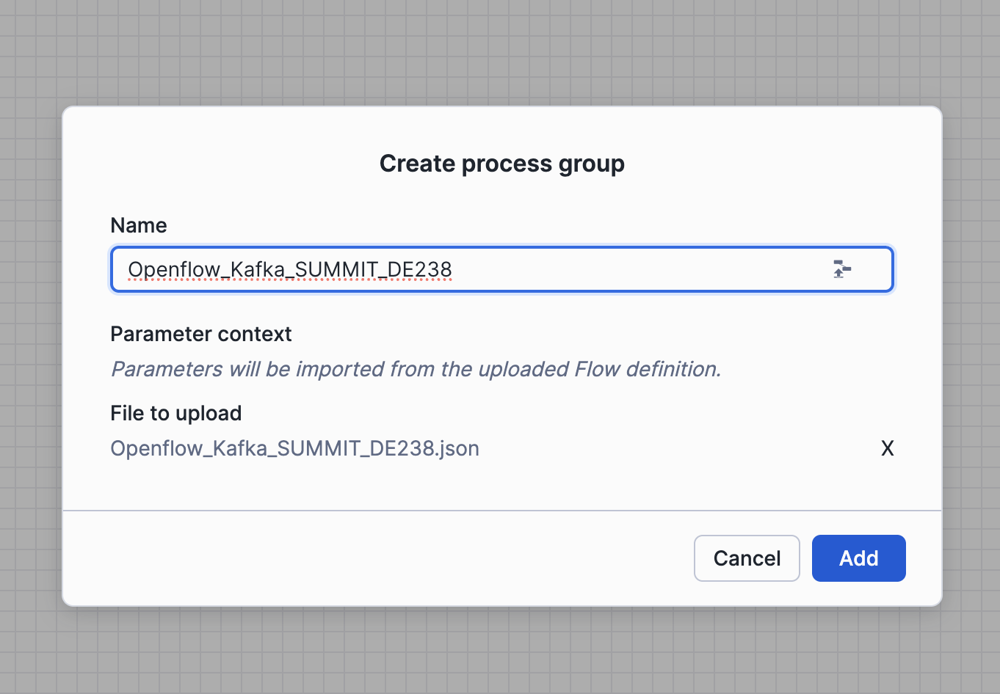

See [`4_openflow/README.md`](4_openflow/README.md) for full parameter reference.

### 7. Check raw Data and Test dynamic tables

Once data is flowing through Openflow, the dynamic tables in the `TRANSFORM` schema will auto-refresh (1-minute target lag). Verify they are populated:

```sql
USE ROLE SUMMIT_DEVELOPER_ROLE_DEV;
USE WAREHOUSE SUMMIT_WH_DEV;
USE SCHEMA SUMMIT_DB_DEV.TRANSFORM;
SHOW DYNAMIC TABLES;

SELECT COUNT(*) AS orders FROM DT_ORDER_SUMMARY;
SELECT COUNT(*) AS packages FROM DT_PACKAGE_TRACKING;
SELECT COUNT(*) AS hops FROM DT_PACKAGE_HOPS;
SELECT COUNT(*) AS locations FROM DT_LOCATION_ACTIVITY;
```

### 8. Run AI-powered fraud detection

Generate orders with a higher fraud rate:

```bash
python3 3_generate/tms_producer.py --count 50 --delay 0.5 --fraud-rate 0.10
```

Run the fraud detection notebook (`5_fraud_detection/fraud_detection_notebook.ipynb`) to:
1. Score payments using 6 heuristic fraud signals
2. Enrich flagged payments with Cortex AI — `AI_CLASSIFY` assigns a fraud type (`identity_theft`, `card_testing`, `account_takeover`, etc.) and `AI_COMPLETE` generates a natural language explanation
3. Write results (including `FRAUD_TYPE` and `EXPLANATION`) to `SUMMIT_DB_DEV.TRANSFORM.FRAUD_DETECTION_RESULTS`

```sql
SELECT PAYMENT_ID, FRAUD_SCORE, FRAUD_TYPE, EXPLANATION
FROM SUMMIT_DB_DEV.TRANSFORM.DT_FRAUD_DETECTION
WHERE IS_FRAUD = TRUE
ORDER BY FRAUD_SCORE DESC LIMIT 10;
```

### 9. Query the analytics layer

```sql
USE SCHEMA SUMMIT_DB_DEV.ANALYTICS;
SELECT * FROM ORDER_SUMMARY ORDER BY ORDER_DATE DESC LIMIT 10;
SELECT * FROM PACKAGE_TRACKING WHERE PACKAGE_STATUS != 'DELIVERED';
SELECT * FROM FRAUD_DETECTION WHERE IS_FRAUD = TRUE ORDER BY PAYMENT_TIMESTAMP DESC;
SELECT * FROM LOCATION_ACTIVITY ORDER BY ACTIVITY_DATE DESC, NUM_PACKAGES DESC LIMIT 10;
```

### 10. Create semantic view using Cortex Code

TODO

### 11. Work with Cortex Agents and Snowflake CoWork

TODO

### 10. Bonus: Configure github actions for your DCM project

TODO

### 11. Bonus: Use Cortex Code to identify problems in the pipeline

TODO

## Tear down

```bash
snow sql -f 2_dcm_project/scripts/tear_down.sql \
  --variable "env_suffix=_DEV" --enable-templating JINJA
```

See [`1_bootstrap/README.md`](1_bootstrap/README.md) for dropping the account-level resources (deployment, database, warehouse, role).

## Architecture

```
Kafka/Redpanda ──► Openflow ──► RAW (9 tables)
                                  │
                          ┌───────┴───────┐
                          ▼               ▼
                 TRANSFORM Layer 1    TRANSFORM Layer 2
                 (9 clean DTs)        (5 analytic DTs)
                                          │
                                          ▼
                                    ANALYTICS (5 views)
                                          │
                                          ▼
                                    Cortex Agent / Dashboards
```

## Related Resources

- [Quickstart Guide](de238_quickstart.md) — Full step-by-step walkthrough with screenshots
- [DCM Projects Documentation](https://docs.snowflake.com/en/user-guide/dcm-projects/dcm-projects-overview)
- [Openflow Documentation](https://docs.snowflake.com/en/user-guide/data-load/openflow/openflow-overview)
- [Dynamic Tables Documentation](https://docs.snowflake.com/en/user-guide/dynamic-tables-about)
- [Cortex AI Documentation](https://docs.snowflake.com/en/user-guide/snowflake-cortex/overview)
